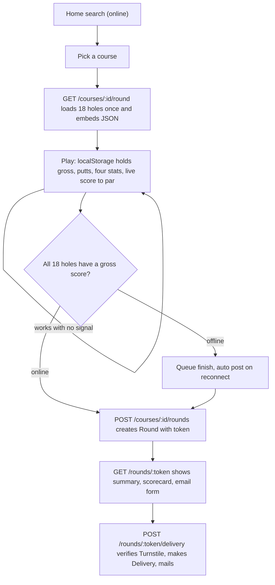
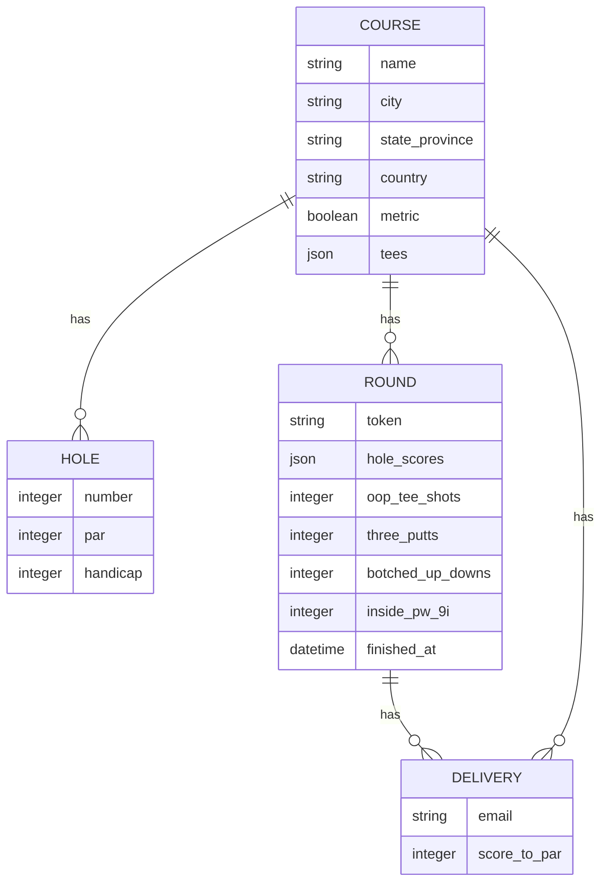

# Grind: golf score tracker MVP

This is the execution plan for the Grind MVP. It is written so any AI or human can
execute it in ordered steps. Each numbered step is one commit and the full test
suite must stay green before that commit is made.

## Goal and shape
A free, no login golf score tracker hosted at `https://grind.fdo.cr`. A user finds a
golf course, tracks each hole gross score and putts plus four custom stats, and the
tracking screen keeps working with no signal out on the course. When the round is
complete the user can ask for an email of their stats, gated by Cloudflare Turnstile.
Self hostable by anyone via the ONCE CLI, exactly like the `ugo` project that inspires
this one.

## Confirmed decisions
- Frontend: Hotwire (Turbo and Stimulus) on importmap, no Node and no bundler, mirroring `ugo`.
- Offline scope: only the active round must work offline. The course (18 holes) loads
  once while online, then all hole entry, the four counters and the scorecard work with
  no connectivity and sync on reconnect. Search and email need connectivity.
- Round ownership (no auth): client first. While playing, the round lives only in the
  browser local store. A server `Round` record is created when the round is finished or
  when a stats email is requested.
- Per hole data on the server `Round`: a single JSON column `hole_scores`. The four
  custom stats are integer columns.
- Palette: fairway green primary, warm sand and amber secondary, slate neutral, set in
  one Tailwind theme file.
- Under par scores may use a numeric minus (for example `-2`). The "no dash" rule
  applies to prose copy, code comments and markdown docs, not to numeric notation.

## Stack (matches ugo where possible)
- Rails ~> 8.1, Ruby 3.4.5, Propshaft, importmap, Turbo, Stimulus, minitest.
- `tailwindcss-rails` v4 with all tokens in `@theme` and component classes in `@layer components`.
- SQLite primary, cache, queue and cable; `solid_queue` run inside Puma via a plugin;
  `solid_cache`; `solid_cable`.
- `mission_control-jobs` mounted at `/jobs`, secured with HTTP basic auth from ENV.
- `dotenv-rails` for local ENV; `honeybadger` that self disables when no key is present.
- Cloudflare Turnstile verified by a small service object (no extra gem), keys from ENV.
- Deploy: a prebuilt public image on `ghcr.io/<owner>/grind` installed with the ONCE CLI,
  behind Cloudflare orange cloud (SSL Full strict). Kamal scaffolding is dropped.

## Architecture: round lifecycle (client first, offline capable)



## Data model



Notes from the sample data (100 courses, all 18 holes): `par` and `handicap` are
constant across tee boxes (zero holes vary), so they live on `Hole`. Per tee `slope`,
`rating` and the 18 `yardage` values vary, so they live in a `tees` JSON column on
`Course` (display only for the MVP). `metric` is a boolean used only for yardage display.

## Routes (RESTful, the Rails way)

```ruby
root "courses#index"

resources :courses, only: :index do
  get :round, on: :member
  resources :rounds, only: :create
end

resources :rounds, only: :show, param: :token do
  resource :delivery, only: :create
end

get "manifest" => "rails/pwa#manifest", as: :pwa_manifest
get "service-worker" => "rails/pwa#service_worker", as: :pwa_service_worker

mount MissionControl::Jobs::Engine, at: "/jobs"

if Rails.env.development?
  namespace :dev do
    get "styleguide", to: "styleguide#show"
  end
end
```

## Step by step (each step is one commit, suite stays green)

### Step 1: Foundation and runtime config
- Gemfile: add `tailwindcss-rails`, `dotenv-rails`, `mission_control-jobs`, `honeybadger`.
- `config/puma.rb`: add `WEB_CONCURRENCY` workers with `preload_app!` when greater than 1;
  run `plugin :solid_queue unless ENV["SOLID_QUEUE_IN_PUMA"] == "false"`; `plugin :honeybadger`;
  `plugin :tailwindcss` in development only so a single `bin/rails server` runs web, the CSS
  watch and jobs.
- Pool sizing: add `lib/grind/database_pool.rb` (max of `RAILS_MAX_THREADS` and
  `SOLID_QUEUE_THREADS` plus overhead) and use it in `config/database.yml`.
- `config/environments/production.rb`: add
  `config.solid_cache.connects_to = { database: { writing: :cache } }`; set
  `config.assume_ssl` and `config.force_ssl` true for Cloudflare; set the mailer host and
  `config.hosts` from an `APP_HOST` ENV var and exclude `/up`.
- `config/queue.yml`, `config/cache.yml`, `config/recurring.yml` tuned with ENV like ugo.
- `.env.sample`: `APP_HOST`, SMTP values, `HONEYBADGER_API_KEY`,
  `CLOUDFLARE_TURNSTILE_SITE_KEY`, `CLOUDFLARE_TURNSTILE_SECRET_KEY`,
  `MISSION_CONTROL_USERNAME`, `MISSION_CONTROL_PASSWORD`, and the concurrency vars
  (`WEB_CONCURRENCY`, `RAILS_MAX_THREADS`, `JOB_CONCURRENCY`, `SOLID_QUEUE_THREADS`,
  `DB_POOL`, `SOLID_QUEUE_IN_PUMA`).
- Initializers: `config/initializers/smtp.rb` builds ActionMailer SMTP from ENV in
  production when `SMTP_ADDRESS` is present; `config/honeybadger.yml` keyed off
  `HONEYBADGER_API_KEY`; `app/controllers/mission_control_controller.rb` does
  `http_basic_authenticate_with` when the ENV credentials are set, wired through
  `config.mission_control.jobs.base_controller_class`.
- Tests: a boot and smoke test; `/jobs` requires basic auth; the SMTP initializer builds
  settings from ENV.

### Step 2: Design system, Tailwind theme, SVG partials, styleguide
- Run the `tailwindcss-rails` installer, then replace `app/assets/tailwind/application.css`
  with `@theme` tokens: `--color-primary-*` (fairway green), `--color-secondary-*` (sand and
  amber), slate neutrals, shadcn style semantic tokens (`background`, `foreground`, `card`,
  `muted`, `accent`, `border`, `input`, `ring`), plus radius, shadow and font tokens. Colors
  change in this one file only.
- `@layer components`: `.ui-btn-*`, `.ui-card`, `.ui-input`, `.ui-label`, `.ui-badge-*`,
  `.ui-banner-*`, `.ui-stat`, `.ui-segmented`, `.ui-search-bar`, tuned mobile first with
  large tap targets.
- `app/views/ui/_*.html.erb` strict locals partials (button, card, input, label, badge,
  banner, segmented, stat, stat_grid, table, search_field, empty_state, form_actions).
- `app/views/shared/svg/_*.html.erb` icons used by the app (search, plus, minus, flag,
  chevron_left, chevron_right, envelope, check, close, share, info, spinner, wifi_off) plus
  `UiHelper#icon` so views never inline an SVG.
- Dev only `/dev/styleguide`: a route guard plus `app/controllers/dev/styleguide_controller.rb`
  returning 404 outside development, and `show.html.erb` rendering the real components.
- `app/views/layouts/application.html.erb`: mobile viewport, theme color, Tailwind and
  importmap tags, a slot for the connection banner, and the PWA manifest link (enabled in Step 5).
- Tests: the styleguide renders in development and returns 404 otherwise; the `icon` helper
  renders an svg; a UI partial renders.

### Step 3: Course and Hole models, importer, search homepage
- Migrations: `courses` (name, country, address, city, state_province, zip, phone, website,
  `metric:boolean default false`, `latitude:decimal`, `longitude:decimal`, `tees:json`) with
  indexes on name, city and country; `holes` (course_id, number, par, handicap) with a unique
  index on course_id and number.
- Models: `Course` (`has_many :holes, -> { order(:number) }`, validations, a `search` scope
  over name, city and country, helpers `out_par`, `in_par`, `total_par`); `Hole`
  (`belongs_to :course`, validations 1..18).
- Importer: `lib/tasks/courses.rake` task `grind:courses:import[file]` that reads the YAML,
  upserts each course and its 18 holes, and stores per tee slope, rating and yardages in
  `tees`. Idempotent on a natural key (name, city, state_province). `db/seeds.rb` loads the
  sample file in development. The same task ingests the full database later.
- `CoursesController#index`: search by a query param, Turbo Frame results, mobile first course
  cards per the sketch, and an empty state. `root "courses#index"`.
- Tests: model tests (associations, par totals, search); the importer task against a tiny
  fixture YAML (assert course and hole counts and tees JSON); an index and search controller
  test; course and hole fixtures.

### Step 4: Round tracker page (Hotwire, client first)
- `GET /courses/:id/round` to `RoundsController#new`: renders the tracker and embeds the 18
  holes (number, par, handicap) in a `<script type="application/json">` tag so the page needs
  no further requests once loaded.
- Tracker UI per the sketch: a header (course name, date, current hole, live score to par); a
  stats block with the four counters (OOP Tee Shots, 3 Putts, Botched Up/Down, Inside PW/9i)
  each with increment and decrement icon buttons; per hole gross score and putts entry; hole
  navigation; and a Scorecard view (Hole, Hcp, Score rows with OUT, IN and TOTAL).
- Stimulus: `round_controller.js` holds the full state, persists to `localStorage` keyed by
  course and a client generated round id, computes score to par live, and enforces counter
  rules (OOP Tee Shots, 3 Putts and Botched Up/Down start at 0 with a floor of 0; Inside PW/9i
  starts at 0 shown as `E` and may go negative). `connection_controller.js` shows an online or
  offline banner. Score to par renders as `+N`, `Even` (compact `E`) or a numeric minus like `-2`.
- No server writes yet.
- Tests: a system test (headless Chrome) loads the tracker, adjusts counters, enters scores and
  confirms the scorecard totals update. This becomes part of the Step 8 smoke flow.

### Step 5: PWA service worker, offline caching, manifest
- Enable `app/views/pwa/manifest.json.erb` (name Grind, fairway green theme, icons) and
  `app/views/pwa/service-worker.js` (vanilla, no Node): precache the app shell and cache the
  active tracker route, serving cache first when offline. Register the worker in
  `app/javascript/application.js`, link the manifest in the layout, and uncomment the PWA
  routes in `config/routes.rb`.
- Offline UX: a connection banner, and a finish action that queues when offline and auto
  submits on the `online` event.
- Tests: the manifest and service worker are served; the tracker embeds all hole data so it
  runs with no further requests; a system test toggles a simulated offline state and confirms
  entry still works.

### Step 6: Finish a round, create server Round, show and scorecard
- `Round` model: `belongs_to :course`; `token` via `has_secure_token`; `hole_scores:json`;
  integer stats `oop_tee_shots`, `three_putts`, `botched_up_downs`, `inside_pw_9i`;
  `started_at`, `finished_at`; methods `total_score`, `total_putts`, `score_to_par`; a
  validation that all 18 holes carry a gross score.
- `POST /courses/:course_id/rounds` to `RoundsController#create`: accepts the JSON payload,
  validates completeness, creates the `Round` with a token, and returns the show page.
  `GET /rounds/:token` to `RoundsController#show`: a summary, the full scorecard and the email
  form.
- Client: on finish the `round_controller` posts when online, or queues and auto posts on
  reconnect, then visits the show page.
- A score formatting helper outputs `+N`, `Even` or a numeric minus for under par, used by the
  tracker, the scorecard and the email.
- Tests: the round model (score to par across over par, even and under par; the completeness
  validation), create and show controller tests, and scorecard totals.

### Step 7: Stats email, Turnstile, Delivery, mailer, job
- `Delivery` model: `belongs_to :round`, `belongs_to :course`, `email`, `score_to_par:int`,
  timestamps.
- `app/services/turnstile_verifier.rb`: posts to the Cloudflare siteverify endpoint with the
  secret from ENV and the request IP; in test and when no secret is set it is bypassed through
  a stub seam.
- `POST /rounds/:round_token/delivery` to `DeliveriesController#create`: requires a finished
  round, verifies Turnstile, creates a `Delivery`, and enqueues `SendRoundStatsJob`
  (solid_queue) which sends `RoundStatsMailer#stats` (mobile friendly HTML: course, score to
  par, a per hole table, the four custom stats). The show page email form renders the Turnstile
  widget through an SVG free partial that loads the Cloudflare script.
- SMTP comes from ENV in production. Development uses the default delivery.
- Tests: the deliveries controller (Turnstile pass and fail), the mailer content (with a copy
  check that prose carries no dash), the job enqueue and delivery, `Delivery` creation, and an
  integration test from a finished round to a queued email.

### Step 8: System smoke tests and CI
- One to three system tests in `test/system` driven by headless Chrome. The main smoke test
  covers the full flow: search a course, start a round, enter gross and putts and adjust the
  four stats across holes, finish, post, confirm the scorecard on the show page, then request
  the email with Turnstile stubbed and assert the `Delivery` and queued mail. A second optional
  test covers the offline indicator and resume from `localStorage`.
- `test/application_system_test_case.rb`: `driven_by :selenium, using: :headless_chrome`.
- CI in `.github/workflows/ci.yml`: keep `scan_ruby` (brakeman, bundler-audit), `scan_js`
  (importmap audit), `lint` (rubocop with cache) and `test`. Update `system-test` to install
  `google-chrome-stable`, build assets (Tailwind), run `test:system`, and keep the screenshot
  artifact on failure (already present in the scaffold).

### Step 9: Deployment (ONCE and GHCR) and docs
- `Dockerfile`: keep the Thruster based production image, ensure `libvips` and `sqlite3`,
  Tailwind precompiled during `assets:precompile`, a non root user and the `storage/` volume;
  `bin/docker-entrypoint` runs `db:prepare` then `db:migrate`.
- `hooks/pre-backup` and `hooks/post-restore` for consistent SQLite snapshots, copied into the
  image (the ONCE backup pattern from ugo).
- Drop Kamal: remove `config/deploy.yml` and `.kamal/` and the `kamal` gem; confirm
  `.dockerignore` ignores every `.env` file and `storage/*`.
- `.github/workflows/docker-release.yml`: on pushing a `v*` tag, build `linux/amd64` and push
  to `ghcr.io/<owner>/grind` tagged with semver and `latest`, with `packages: write` and the
  GitHub Actions layer cache (no GeoLite2 needed here).
- Docs: a concise `README.md` like ugo, plus `docs/local-quickstart.md` (setup, seed the
  sample courses, run the server and the tests) and `docs/self-hosting.md` (ONCE install,
  Cloudflare Full strict, ENV vars, securing `/jobs` with basic auth, importing the full
  course database).

## Cross cutting rules (apply in every step)
- No dash in prose: UI copy, code comments and markdown docs avoid the hyphen and any dash.
  A numeric minus for under par scores is the only exception. Build date and copy strings
  accordingly (for example `Fri Jun 19, 2026`).
- Mobile first with large tap targets everywhere; the tracker is usable one handed.
- All SVGs live in `app/views/shared/svg/_*.html.erb` and render through the `icon` helper or a
  partial render; never inline an SVG in a view.
- Colors and design tokens are configurable only in `app/assets/tailwind/application.css` and
  never hardcoded across views.
- All third party config (SMTP, Honeybadger, Turnstile, Mission Control auth, concurrency)
  comes from ENV, never from a database settings record.
- Every commit keeps the full suite green and adds tests for the work in that step.
